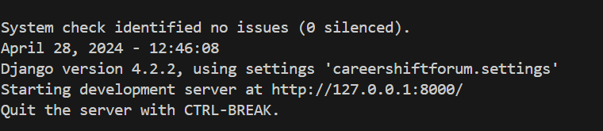

# *CareerShiftersWebsite*
## _Discuss switching careers with fellow folks on this forum..._

### 1. IDE (Visual Studio or your preferred IDE & Python with Django module)

### 2. The Docs file is used with Sphinx, which automates the documentation & layout of files.

#### 2.1 Docs\build\index.html (access document here in index.html, install Sphinx and install  sphinx_rtd_theme). Have a look at the conf.py file. Docstrings to describe every class, definition, etc. will be a heavy task. For now, you can see the layout of how the Django project was built. Some docstrings added. 
#### There are some inline comments without cluttering code. 
#### Will add more docstrings when I find it useful. I suggest you watch Django tutorials on how `settings.py`, static files,
#### `models.py`, `forms.py`, `views.py` & `urls.py` are linked and all run through `manage.py`. And research models of how Django is set up. 
### To read Sphinx documentation, install below:
#### choco install sphinx
#### pip install -U sphinx
#### py -m pip install sphinx-rtd-theme
## Sphinx theme may not work; it may use the alabaster theme as default because the theme is unsupported with the new version of Sphinx.

### 3. Installation (Below is using PowerShell terminal; command prompt differs slightly)

### Also note the below is for Windows OS; commands may differ slightly for Linux and macOS. 
#### 3.1 Clone the repository with the command below. Must have Git & GitHub installed. 
#### git clone //https://github.com/GJprocode/DjangoWebsiteProduction
#### 3.2 Move to the project root folder
#### cd name of root folder
#### 3.3 Create a virtual environment
#### py -m pip install virtualenv (Install virtual environment)
#### virtualenv 'env1' - (create a virtual environment and give it a name)
#### env1\scripts\activate (activate the virtual environment that stores all your modules for your project)
#### 3.4 Install requirements.txt (this will install all the modules you will need to run this web app)
#### py -m pip install -r requirements.txt
#### Make migrations every time models are changed
#### py manage.py makemigrations
#### py manage.py migrate
#### 3.5 Run your app on the local server (not deployed live; see Docker section 5)
#### py manage.py runserver (Ctrl-click on the URL; a window will open in your default browser, sign up and play with the app, Ctrl+C to break the local server connection)
#### You will see below:

#### Run 'deactivate' in the terminal when done; this deactivates your virtual environment
#### and you can further alter the program as you wish. 

### 4. Preview of the app

### 5. Docker (Containerizing apps) If you want it to run the same on every device. (Have Docker Hub and Docker Desktop installed)
### Link to hub.docker.com remote repository: https://hub.docker.com/repository/docker/crypticdg/careershiftersforum/general

#### Docker is a popular virtualization software that helps its users in developing, deploying, monitoring, 
#### and running applications in a Docker Container with all their dependencies. 
#### (ref, https://www.simplilearn.com/tutorials/docker-tutorial/docker-vs-virtual-machine)

#### Run in the terminal: docker build -t python-django-app (your image name) . (creates an image; can see the image in Docker Desktop)   
#### Run in the terminal: docker run python-django-app (your image name) (creates/runs a container; can see the container in Docker Desktop)   
#### Run in the terminal: print id: docker ps
#### Run in the terminal: stop id/close, shut down containers: docker stop [ID]  (first three letters of ID)
#### ----Deploy Docker image----
#### https://hub.docker.com/
#### Create a repository; call it my-website (or any name of your choice); make sure it's public
#### Run in the terminal: run, docker tag [name of website/app under build] my-website [user]/[repo]
#### Run in the terminal: example: docker tag my-website john/my-website
#### Run in the terminal: docker login
#### Run in the terminal: upload image:  docker push [user]/[repo] ie. docker push john/my-website
#### You will see a Linux image under your repo in Docker Hub online

### Special note: When installing Docker, be sure to read the requirements/documentation for your operating system.
### It is possible to get a BSOD, blue screen if not set up properly with your antivirus, 
### as you are running Linux/Ubuntu on your Windows Machine. Or whichever OS you are running. 

# *HAVE FUN, AND ENJOY THE APP!!!! And recreating, adding different functionality, and running it!
